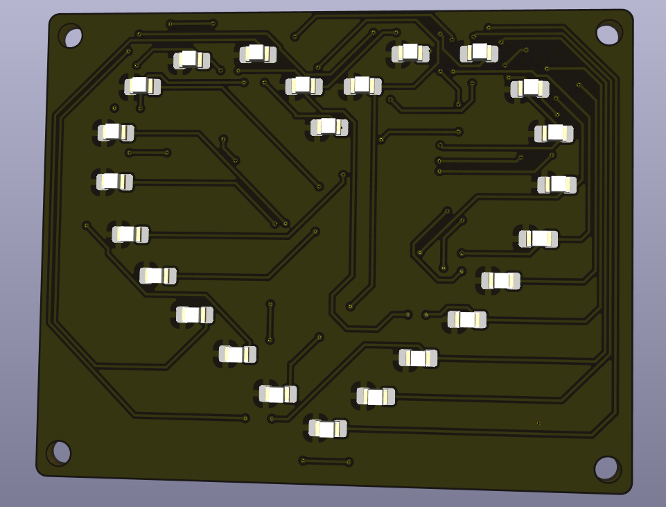
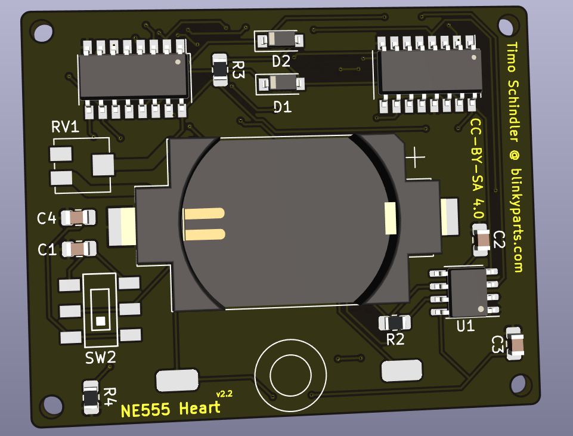

# Heart SMD NE555
24 LEDs forming a LED-Heart driven by a NE555 bistable vibrator. A LED-Light runs around the heart. The speed of the running LED-light can be modified by the potentiomenter
This soldering Kit requires first experience in SMD-Soldering and is a very good practice for the size 0805.

 

- Status: **Complete**
- Difficulty: **3/5**

### Parts List

| Description                   |  Name  | Quantity |
|-------------------------------|:------:|:--------:|
| SMD LED 0805 red              | D5-D28 |    24    |
| SMD Capacitor 10nF            |   C1   |     1    |
| SMD Capacitor 100n            |  C2,C3 |     2    |
| SMD Capacitor 1uF		|   C4	 |     1    |
| SMD Diode 1N4007              |  D1-D2 |     2    |
| SMD Push Button               |   SW1  |     1    |
| SMD Sliding Switch            |   SW2  |     1    |
| RV1 Potentiometer             |   RV1  |     1    |
| SMD Resistor 0805 1k          |   R2   |     1    |
| SMD Resistor 0805 100k        |   R3   |     1    |
| SMD Resistor 0805 47R         |   R5   |     1    |
| NE555 SOIC-8                  |   U1   |     1    |
| CD4017 SOP-16                 |  U2,U3 |     2    |
| CR2032 Battery Holder (SMD)   |   BT1  |     1    |
| CR2032 Battery (not included) |        |     1    |

### Manual
You can find the manual and pictures of every step here: https://github.com/Binary-Kitchen/SolderingTutorial

### Buy Kits

You can also buy a ready to make soldering-kit @ [shop.blinkyparts.com](https://shop.blinkyparts.com/de/SMD-LED-Herz-mit-NE555-SMD-Bausatz-mit-Herz/blink232542).

### Copyright and Authorship

- Board: [CC-BY-SA 4.0](https://creativecommons.org/licenses/by-sa/4.0/) - [Timo Schindler @ blinkyparts.com](https://shop.blinkyparts.com)
- CR2032 battery holder footprint: [CC-BY 4.0](https://creativecommons.org/licenses/by/4.0/) - Sparkfun (https://github.com/sparkfun/SparkFun-KiCad-Libraries)
